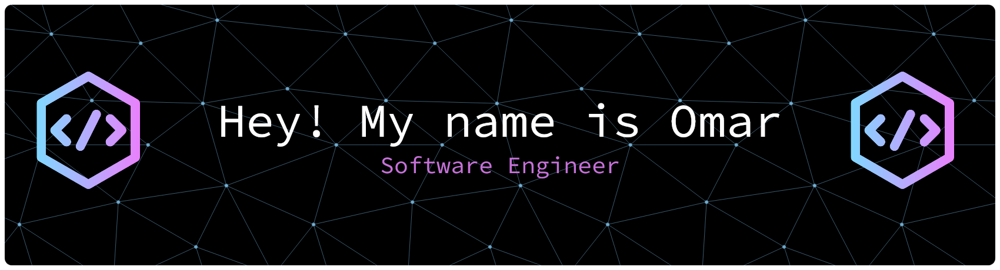

  

  🎓 <b>Computer Science Student</b> with a passion for clean code (and perfectly placed @Overrides). 
  🔍 <b>Extremely curious person:</b> I love diving deep into how things work and staying updated with the latest tech. 
  ♟️ <b>Chess player & Book lover:</b> When I'm not coding, you'll probably find me analyzing a match or lost in a good book.

<h2> 🚀 &nbsp;Tools I Have Used and Learned</h2>

